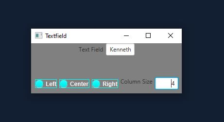

# TextField

The description of this program is create a Textfield with buttons that determines the horziontal allignment and column-size properties
dynamically, meaning that you can change it on the fly and the size/allignment will change depending on the values you choose and what allignment you want it to have.

## Example Output



## Analysis Steps

This section should restate the assignment and explain how you analyzed the requirements in order 
to develop a solution.

The assignment basically wants me to create an HBox that has radioButtons that designate the horizontal allignment and a column box that you can input a value into
to determine the size of a column that also changes the size and allignment dynamically, meaning in real-time, meaning you don't need to run the program over to see the effects.
I analzyed the requirements to develop a solution by simply just looking at the notes and overall descriptions of the pearson chapter and concluded that it would need buttons, HBox, Textfield and a vBox to display using a Stage. All the information is there for me to see and analzye what I exactly need.

### Design

No I just used one whole class for this program with a bunch of javaFX methods/objects. Buttons, Textfields HBoxes stood
out the most during the project and were very needed in order to make this program work. 

```
An Example of this would be 
TextField Demo = new TextField();
       TextField Column = new TextField();
       This is my textfield it only requires two objects as stated in the requirements which is column size and horizontal allignment
       which then I apply the allignment to my box using 
       Demo.setAlignment(Pos.CENTER_LEFT);
       Column.setAlignment(Pos.CENTER_RIGHT);
```

### Testing

A step by step series of examples that you developed to properly test the program. 

Step One: Create the Textfield

```
  TextField Demo = new TextField();
       TextField Column = new TextField();
```

Step Two: Set Allignments

```
Demo.setAlignment(Pos.CENTER_LEFT);
       Column.setAlignment(Pos.CENTER_RIGHT);
```

Step Three: Create Buttons & Make it so one button is selected

```
RadioButton ButtonL = new RadioButton("Left");
       RadioButton ButtonC = new RadioButton("Center");
       RadioButton ButtonR = new RadioButton("Right");
       ButtonL.setStyle("-fx-color: cyan; -fx-text-fill: white; -fx-font-weight: bold; -fx-font-family: 'Georgia' ");
       ButtonC.setStyle("-fx-color: cyan; -fx-text-fill: white; -fx-font-weight: bold; -fx-font-family: 'Georgia' ");
       ButtonR.setStyle("-fx-color: cyan; -fx-text-fill: white; -fx-font-weight: bold; -fx-font-family: 'Georgia' ");
       HBox hBox2 = new HBox(8);
       hBox2.setAlignment(Pos.CENTER);
       hBox2.getChildren().addAll(ButtonL, ButtonC, ButtonR);
       
       ToggleGroup group = new ToggleGroup();
       ButtonL.setToggleGroup(group);
       ButtonC.setToggleGroup(group);
       ButtonR.setToggleGroup(group);
       
      ButtonL.setOnAction(e -> Demo.setAlignment(Pos.BASELINE_LEFT));
      ButtonC.setOnAction(e -> Demo.setAlignment(Pos.BASELINE_CENTER));
      ButtonR.setOnAction(e -> Demo.setAlignment(Pos.BASELINE_RIGHT)); 
```
Step Four: Set scene and place it in stage

```
Scene scene = new Scene(vBox);
       vBox.setStyle("-fx-background-color: gray; -fx-text-fill: white;");
       primaryStage.setTitle("Textfield");
       primaryStage.setScene(scene);
       primaryStage.show();
```

Step Five: Make ColumnSize Dynamic

```
Column.setOnAction(e->
                Demo.setPrefColumnCount(Integer.parseInt(Column.getText())));
        Label lblColumnSize = new Label("Column Size", Column);
        lblColumnSize.setContentDisplay(ContentDisplay.RIGHT);
```

You won't get any data from the program, but it can be used as a little demonstration for future projects
so you know how to make these objects dynamic
Such as when I type my name Kenneth Cottrell
When I press left, it will allign to the left, and vice-versa.
When I type the column length, it will change so lets say I type only 4 in the column box when I have my full name typed
It will only show my first name.
So that's a little big of a demonstration in words, on what the program does, so you can use this as a future reference.

## Notes

No issues, the pearson notes helped me develop this program very easily

## Do not change content below this line
## Adapted from a README Built With

* [Dropwizard](http://www.dropwizard.io/1.0.2/docs/) - The web framework used
* [Maven](https://maven.apache.org/) - Dependency Management
* [ROME](https://rometools.github.io/rome/) - Used to generate RSS Feeds

## Contributing

Please read [CONTRIBUTING.md](https://gist.github.com/PurpleBooth/b24679402957c63ec426) for details on our code of conduct, and the process for submitting pull requests to us.

## Versioning

We use [SemVer](http://semver.org/) for versioning. For the versions available, see the [tags on this repository](https://github.com/your/project/tags). 

## Authors

* **Billie Thompson** - *Initial work* - [PurpleBooth](https://github.com/PurpleBooth)

See also the list of [contributors](https://github.com/your/project/contributors) who participated in this project.

## License

This project is licensed under the MIT License - see the [LICENSE.md](LICENSE.md) file for details

## Acknowledgments

* Hat tip to anyone who's code was used
* Inspiration
* etc
